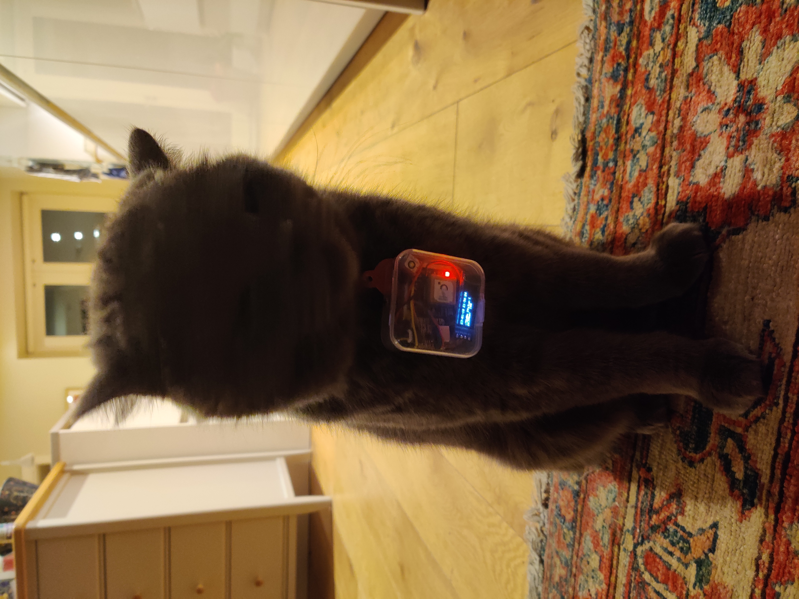
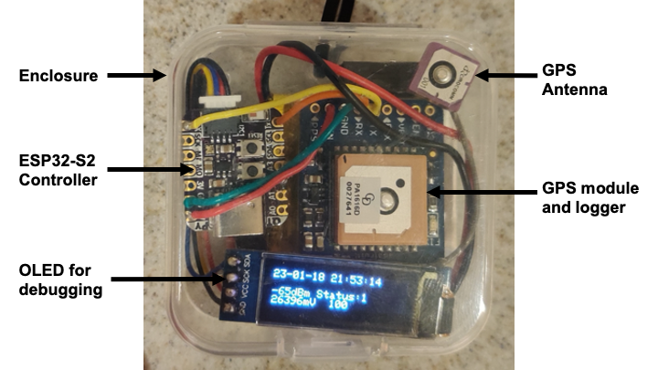
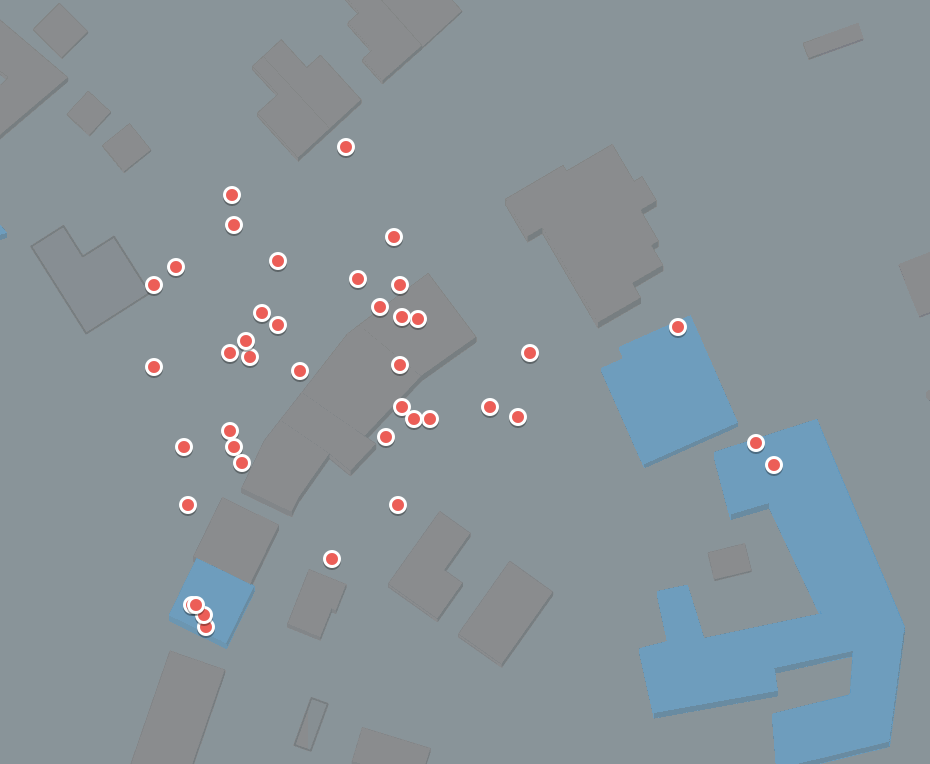
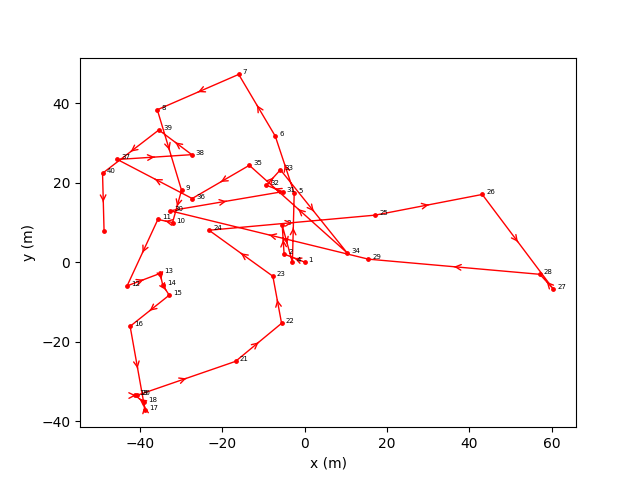

# Cat GPS Tracker ESP32 IoT Project

The aim of this project was to create a tracker for outdoor cats, so owners can gain a better understanding of where there cat goes at certain times. GPS was used to determine location as it is inexpensive and is fairly accurate (3m).  
\*Note: this project is still a work in progress. More content to follow.

<figure>
     

    
    <figcaption>
    
    <strong>Figure 1:</strong> Participant 143910 (Teddy) wearing the GPS tracker prior to mission.
    
    

    </figcaption>
</figure>

An Adafruit [GPS module](https://www.adafruit.com/product/746) provides location data, A [QT Py](https://www.adafruit.com/product/5325) microcontroller with an ESP32-S2 chip is used to control the GPS module. The controller has wifi capabilities so can be used for IoT applications.

## Architecture
An object-oriented approach to the software architecture has been taken. Classes have been defined on a component/funcational basis, e.g. there is a class for handling AWS IoT Core commands, one for the GPS and another for broader WiFi operations.

## Algorithm
\*TODO\*
<!-- 1. Check if wifi is connected and GPS has a fix
if you have a fix:
    Keep logging GPS data
if not:
    Check the last time you had a fix:
        if > 10 mins:
            Can assume you are indoors
            Check you have a stable wifi connection
            if yes:
                Start uploading data to AWS
            if no:
                Go to sleep for 2 mins
2. Check the last time you had a -->

## Components

### GPS
The GPS module is the most important component of this system. I have written a [GPS class](/lib/gps_utils/src/gps_utils.cpp) inherited from the [Adafruit GPS library](https://github.com/adafruit/Adafruit_GPS) to handle communication with the module.

<figure>
     

    
    <figcaption>
    
    <strong>Figure 2:</strong> Cat GPS Tracker with components labeled.
    
    

    </figcaption>
</figure>

The GPS has four modes:
* Log - GPS data is logged using the modules on-board logger
* View - Used to just view the GPS data over serial connection. Useful for debugging
* Erase - For erasing the data on the logger
* Dump - For retreiving the data from the logger and outputting it via serial in CSV format

### AWS IoT Core
\*TODO\*

* Battery
* Enclosure
* Microcontroller

## Data Analysis
Some example data collected from my cat, plotting the longitude and latitude using Google's mymaps:

<figure>
     

    
    <figcaption>
    
    <strong>Figure 3:</strong> Google My Maps data of cat GPS data.
    
    

    </figcaption>
</figure>

Using the Python [utm](https://www.github.com/Turbo87/utm) module, we can convert lat/long values to UTM, which can then be converted to x and y coordinates in metres relative to a datum.

<figure>
     

    
    <figcaption>
    
    <strong>Figure 4:</strong> Same GPS data plotted after UTM conversion to East and North (x and y).
    
    

    </figcaption>
</figure>

## Test-Driven Development
The unity framework was used for testing C/C++ code. The tests have been broken down into three .cpp files, to test each of the main subsystems: [test_aws.cpp](/test/test_aws/test_aws.cpp), [test_wifi.cpp](/test/test_wifi/test_wifi.cpp) and [test_gps.cpp](/test/test_gps/test_gps.cpp)

### Unit Testing

### GPS
The GPS is a fundamental part of the overall system, hence thorough unit tests have been implemented.

### Mocking
A mocking class for the GPS module was made to test functions not requiring a connection to the physical hardware. Such as parsing the GPS buffer in NMEA format, parsing data from the logger, where you need to detect the type of PMTKLOX e.g. start of log, data, and end.
